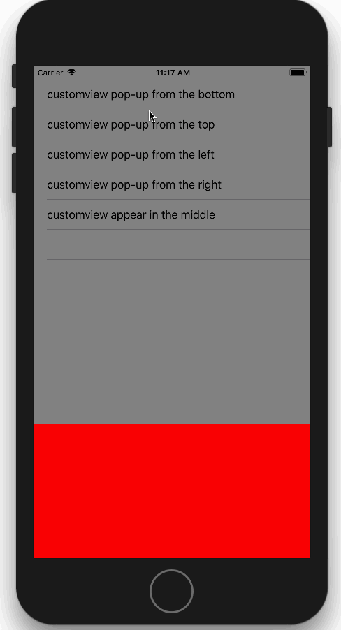

# ZTModalShow
####ZTModalShow  is a simple and useful modal show library. 

[](Screenshots/iphone.png)

## Installation

### CocoaPods

If you're using [CocoaPods](http://www.cocoapods.org), simply add `pod 'ZTModalShow'` to your Podfile.

### Drag & Drop

Just add the `UIViewController+ModalShow.h`+ `UIViewController+ModalShow.m` file to your project. If you don't have ARC enabled, you will need to set a `-fobjc-arc` compiler flag on the `.m` source files.

## Example Usage

#### first you should init a customview 
```objective-c
self.customView                 = [UIView new];
self.customView.backgroundColor = [UIColor redColor];
```
##### remember that you already set width and height (But not so much~ with 'ZTShowOptionDownToUp' and 'ZTShowOptionUpToDown' you will only need to set 'height'.with 'ZTShowOptionLeftToRight' and 'ZTShowOptionRightToLeft' you will only need to set 'width'.with 'ZTShowOptionCenter' you will need set both 'width' and 'height')
```objective-c
self.customView.frame           = CGRectMake(0, 0, 200, 200);
```

####  make customview modally show
```objective-c
ModalShowOption *option      = [ModalShowOption defaultOption];
option.showCover             = YES;
option.animationType         = ZTAnimationOptionEaseIn;
option.animationDurationTime = 0.2f;
option.showOption = ZTShowOptionDownToUp;
[self zt_showView:self.customView WithConfiguration:option];
```

#### For more usage of ZTModalShow, see demo in the project 

## Requirements

* ARC
* iOS 8.0 or later
* Xcode 7

## Contact

[Seventeen-17](http://weibo.com/seventeen1717171717)   

## License

ZTModalShow is available under the MIT license. See the LICENSE file for more info.
